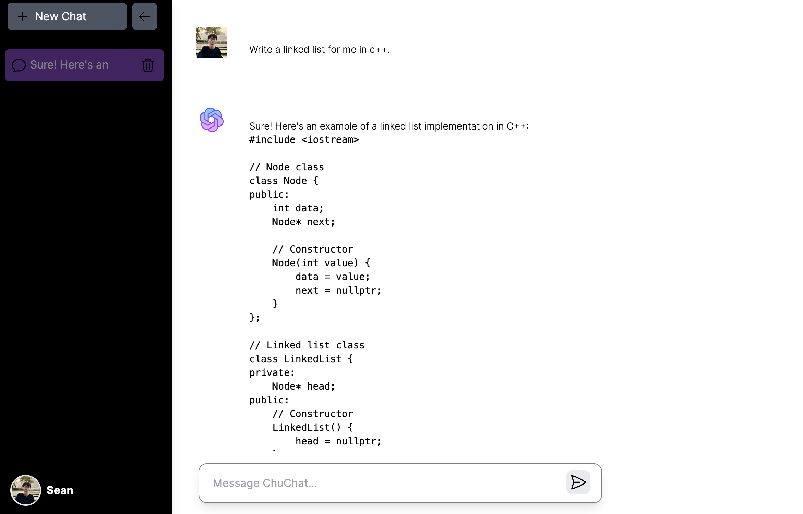

# Chu Chat

 
 

A chat application that integrates

- Google Cloud Vertex AI API
- Open AI API

to provide a better solution for user reference.

## Demo



## Tech Stack

- [next.js/react](https://nextjs.org/)
- Authentication: Next Auth and Google Authentication
- Database: Firestore Database

## Usage

1. After clone the project, install all dependency.

    ```bash
    npm install
    ```

2.
    Create a .env.local file. Insind it, paste your google cloud oauth api secrets, openai api key or other secrets you needed. I list some secrets I used for this project as an example.

    - `NEXTAUTH_URL` is [http://localhost:3000](http://localhost:3000) for local development mode. If you deploy to cloud, change to your own domain name.

    - `GCP_PROJECT_ID` is for calling vertex ai api.

    - `FIREBASE_SERVICE_ACCOUNT_KEY` is for accessing the firebase using firebase admin.

    .env.local

    ```bash
    GOOGLE_ID=
    GOOGLE_SECRET=

    OPENAI_API_KEY=

    NEXTAUTH_URL=
    NEXTAUTH_SECRET=

    GCP_PROJECT_ID=
    
    FIREBASE_SERVICE_ACCOUNT_KEY=
    ```

3. Run the development server

    ```bash
    npm run dev
    ```

4. Open [http://localhost:3000](http://localhost:3000) with your browser to see the result.

## 🧐 Feature

In the future, we could integrate the bing chat feature into the web app.
